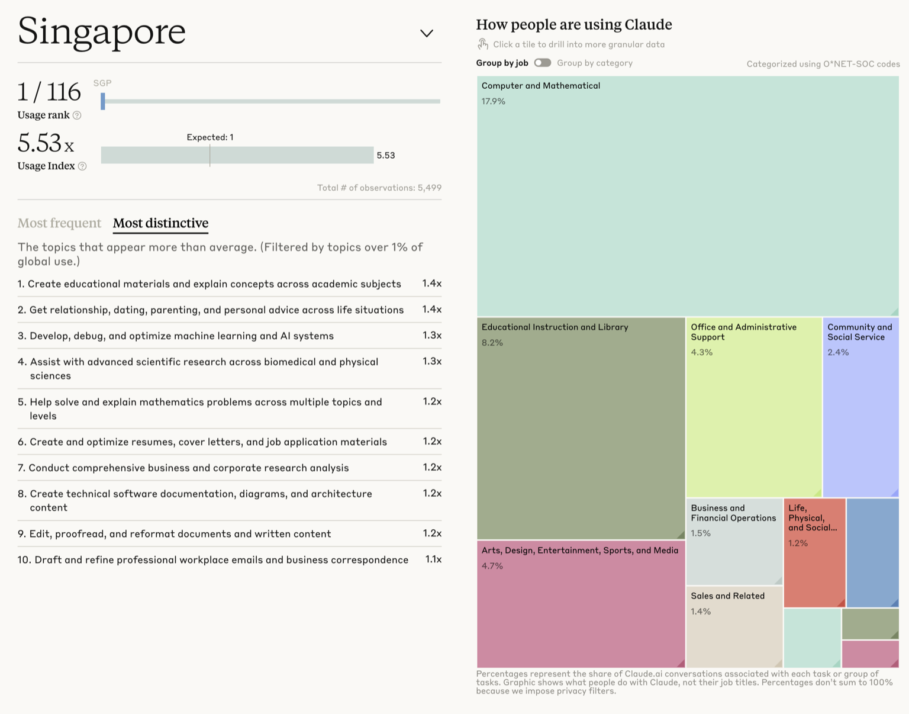

Anthropic 在 2026 年 3 月发布的 Economic Index 报告，配了一个按国家排的 AI 使用强度榜。新加坡排第一，数值 5.53。

这个 5.53 衡量的是人均强度。它的全名是 Anthropic AI Usage Index（AUI），算法是一个比值：一个地区占全球 Claude 使用量的份额，除以它占全球劳动年龄人口的份额。基准线是 1——如果全世界每个上班年龄的人用得一样多，新加坡正好占 1 份。它实际占了 5.53 份。

绝对量是另一回事。这次抽样里，来自新加坡的对话 5499 条，远不如美国、印度这些人口大国。新加坡赢在密度：同样一万个上班的人，用 Claude 的强度是全球平均的五倍多。

榜单旁边还列了新加坡用得比全球平均突出的任务。排在前面的是做教学材料（1.4 倍）、开发和调试机器学习与 AI 系统（1.3 倍）、科研（1.3 倍）、解数学题（1.2 倍）。按职业分，计算机与数学类占了新加坡对话的 17.9%，教育类占 8.2%。

_Anthropic Economic Index 的新加坡页面：使用强度排名 1/116、Usage Index 5.53、抽样对话 5499 条；右侧按职业拆分，计算机与数学类占 17.9%。_

## 为什么是新加坡

AUI 用劳动年龄人口做分母，这个算法偏向小而富、说英语、城市化的经济体。新加坡是个城市国家，没有大片低收入、网络不发达的乡村拉低人均。美国和印度的全国平均，是把旧金山、班加罗尔这样的科技高地，跟大片采用率很低的地区一起摊出来的。新加坡整个国家相当于别人的一个一线城市，人均自然高。再加上英语是工作语言，Claude 这类以英文为主的工具上手没门槛；人均收入高、知识工作者扎堆，而金融和科技正是 Claude 用得最重的两个行业。报告里有一句概括：Claude 在高收入国家、在知识工作者密集的地方用得最重。新加坡非常符合这些条件。

微软 AI 经济研究所另一份报告里，新加坡的生成式 AI 采用率排全球第二，60.9%。换一家公司来算，新加坡还是在最前面。

这些还只是底子。新加坡 2019 年发布第一版 National AI Strategy，2023 年更新到 2.0，2026 年 5 月又公布四项 National AI Missions——先进制造、互联互通、金融、医疗。从 Smart Nation 到 AI Singapore，政府把 AI 能力当基础设施铺，教育、企业采纳计划、监管沙盒一路配套。一个国家从上到下推 AI 普及，人均使用强度高是顺理成章的结果。

## 强度与水平是两件事

这个排名量的是普及强度，跟用得多高级是两回事。

报告里有一条数据正好说明：一些低收入、教育水平较低的国家，平均使用复杂度更高。原因是那些国家采用率极低，只有一小撮技术尖子在用，把平均值抬了上去。所以高 AUI 代表用的人多、用得勤，不代表新加坡人均比别人用得聪明。

报告还有一种分法：把对话分成「自动化」（把活儿整个交给 AI）和「增强」（人和 AI 来回协作）。Claude.ai 上增强占 53%，自动化占 44%，增强还在上升。结合新加坡突出的那几类任务——教学、科研、写代码、解数学——更像重度但偏协作的用法：人提问、改、再问，自己还在里面。

## 意味着什么

在美国内部，各州的人均使用强度在收敛，落后的州在追上来。国家之间相反，差距在拉大：用得最重的前 20 个国家，占了按人口调整后总使用量的 48%，比上一期的 45% 还高。

报告里另有一个发现：用 Claude 越久的人，成功率越高，也更会拿它处理更难的活儿。早用、多用、用得顺，于是用得更多——先上手的国家会越拉越开。

对公司也是一样。一个团队用了一年，知道什么活儿配什么模型、问题怎么问、AI 哪里会出错；刚上手的团队这些都得从头摸。用得越久，这点差距拉得越大。

## 参考来源

- [The Anthropic Economic Index report: Learning curves](https://www.anthropic.com/research/economic-index-march-2026-report)（2026 年 3 月 24 日）
- [Anthropic Economic Index — Country usage](https://www.anthropic.com/economic-index#country-usage)
- 数据集：[Anthropic/EconomicIndex on Hugging Face](https://huggingface.co/datasets/Anthropic/EconomicIndex)
